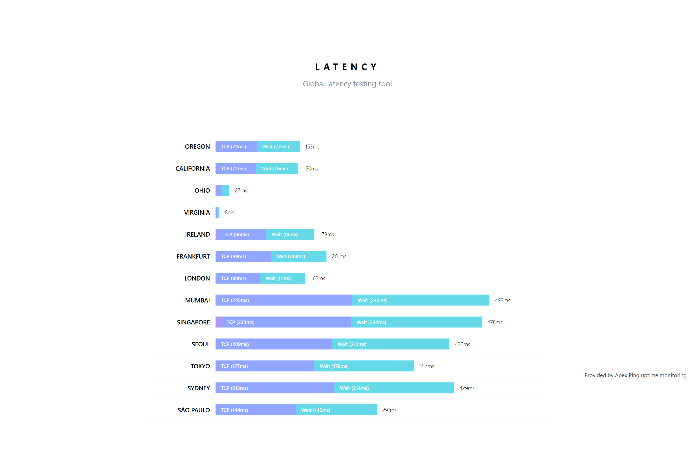
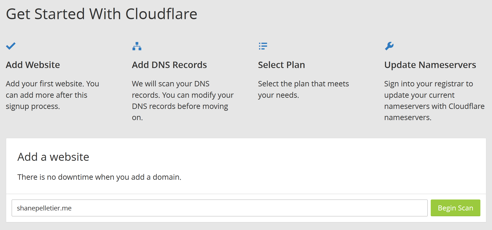
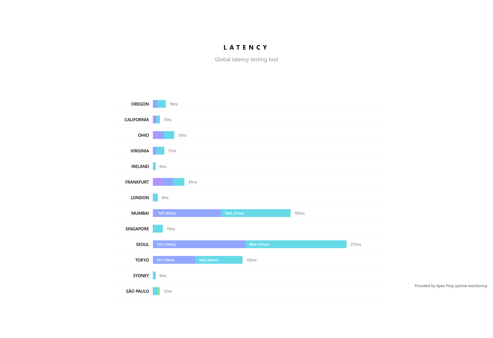

While working on a React Native app today, I found a [tool](https://latency.apex.sh) to measure the latency of a website from many different locations around the world. Being the curious person that I am, I threw in this domain to see what my results looked like.

The results were... not great. North America and some parts of Europe are reasonable, but latencies further away were much higher than I would like. So, I decided to move my site to Cloudflare to take advantage of their free DNS and CDN.

Setting up Cloudflare was much easier than I would've expected. After filling out a standard sign-up form, I was brought to a page to enter my domain name.

Cloudflare did its thing for around a minute while I was treated to a short video describing the service and a bit about what it can do, which is a neat way to keep the user patient while the task was running. The next page asked me to make sure all of my DNS records were pulled in for the domain, and let me customize which requests would be routed through Cloudflare's network and which to leave alone. Next up was a page asking me to configure the nameservers for my domain.

I use Namecheap to manage all of my domains, and thankfully they made the configuration easy. I simply flipped the "PremiumDNS" switch and chose the "Custom DNS" option for the nameservers, then added the two nameservers Cloudflare told me to use.

After configuring Namecheap and clicking through the rest of the form on Cloudflare, I was presented with the Cloudflare dashboard that's used to manage everything Cloudflare can do. I was also told that DNS updates can take up to 24 hours, so I got back to what I was originally doing. Less than two hours later, I checked my global latency again.

There was no improvement.

It turns out that by default, Cloudflare doesn't cache HTML files. Thankfully, Cloudflare's support is top-notch, and I was quickly able to find a [solution](https://support.cloudflare.com/hc/en-us/articles/115000150272-How-do-I-use-Cache-Everything-with-Cloudflare-). A few minutes later, and I ran my test again.

Much better. There's still plenty of ways I can improve the speed of my site, including:

  * Minifying JS/CSS
  * Compressing with gzip
  * Optimizing PNGs
  * Better browser caching of static content

Thanks to [TJ Holowaychuk](https://twitter.com/tjholowaychuk) for making the latency testing tool I used and being an all-around awesome guy (check out [Up](https://github.com/apex/up) if you're looking for a super-easy way to get started with serverless architectures), and thanks Cloudflare for making using you so easy.
